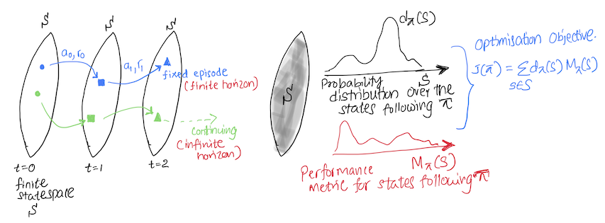
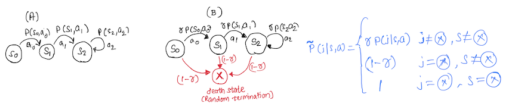

## Overview.
This article summarises concepts related to on-policy Reinforcement Learning (RL) algorithms. Specifically the focus is on looking at the optimisation objectives, on-policy distributions and compare between different RL task settings. 

The interaction between a RL agent and its environment is formulated using the formal Markov Decision Process (MDP) framework, where the underlying task could be either episodic (naturally broken down into identifiable episodes) or continuing (goes on continually over the lifetime of the agent). 

**Notation**: An MDP is defined as a tuple $(S, A, P, r)$, where $S$ is a finite set of states, $A$ is a finite set of actions, $P: S \times A \times S \rightarrow [0, 1]$ is the state transition probability function, where $P(s' \vert s, a)$ denotes the probability of transitioning to state $s'$ from state $s$ after taking action $a$, and $R: S \times A \rightarrow \mathbb{R}$ is the reward function, where $r(s, a)$ gives the immediate reward received after taking action $a$ in state $s$ [1].

A policy $ \pi $ is a mapping from states to a probability distribution over actions: $ \pi : S \times A \rightarrow [0, 1] $, where $ \pi (a \vert s) $ denotes the probability of taking action $ a $ when in state $ s $.

## Understanding the Optimisation Objetive

Our goal is to use an optimisation objetive to learn the optimal policy $ \pi^{\star}(a \vert s) $. A policy can be considered optimal if it achieves a higher expected future reward ($ M_{\pi}(s) $) in every state. Then $ \pi^{\star} $ satisfies $ M_{\pi^{\star}}(s) \ge M_{\pi}(s) $, which gives a partial ordering of policies. However, for non-tabular settings the partial ordering is not sufficient, as we cant represent all policies, instead we approximate a policy, which can have higher $ M_{\pi}(s) $ for one and lower for another state. Therefore, we need to also consider the distribution over the states ($ d^{\pi}(s) $) the agent experience in order to properly evaluate the performance of the agent [2]. 

 

We can design the objective by considering,
- $ M_{\pi}(s) $, a performance metric which estimates the expected future reward of a state $s$, following the policy $\pi$.
- $ d_{\pi}(s) $, a probability distribution over $S$ based on the proportion of time spent in each state following the policy $ \pi $. 

By maximizing the weighted average of $ M_{\pi}(s) $ with each state weighted by $ d_{\pi}(s) $, we can obtain an optimisation objectcive:

$$ 
J(\pi) \doteq \sum_{s \in S} d_{\pi}(s) M_{\pi}(s) .
$$

In the next sections we explore, how $ M_{\pi}(s), d_{\pi}(s) $ change based on the task setting.

## Episodic Tasks

In episodic tasks $ d_{\pi}(s) $ is the on-policy distribution and, $ M_{\pi}(s) $, is the value function $ v_{\pi}(s) =  E_{ s_{t}, a_{t} \sim \pi } \left[ \sum_{t=0}^{t-1} r_{t}(s_{t},a_{t}) \right] $, which represents the expected return when starting in $s$ and following $ \pi $.

$$ 
J(\pi) \doteq \sum_{s \in S} d_{\pi}(s) v_{\pi}(s). 
$$

$d_{\pi}(s)$ can be calculated using the probability that an episode begins in each state s, $h(s)$ and $ \eta(s) $ the number of time steps spent, on average, in state $s$ in a single episode.

$$ 
d_{\pi}(s) = \frac{\eta(s)}{\sum_{s'} \eta(s')},
$$

where, 

$$ 
 \eta(s) = h(s) + \sum_{\bar{s}} \eta(\bar{s}) \sum_{a} \pi (a \vert \bar{s})P(s \vert \bar{s},a).

$$

## Continuing Tasks: Average Reward $(r_{\pi}(s))$ Setting 

In the average reward setting, $ M_{\pi}(s) $ represents the average one-step reward received by the agent following $\pi$, where $r_{\pi}(s) = \sum_{a \in A} \pi(a \vert s)r(s, a)$. 

$$ 
J(\pi) \doteq \sum_{s \in S} d_{\pi}(s) r_{\pi}(s). 
$$

In continuing tasks $d_{\pi}(s)$ is the stationary distribution over the states. Under certain conditions it can be shown that regardless of the start state ($ s_{0} $), the stationary distribution converges to $ d_{\pi}(s) $, where, if $ d_{\pi}(s) = 0 $, $ s $ is called a transient state. 

$$ 
d_{\pi}(s) = \lim_{t\to\infty} P(s_{t}=s|\pi), S_{0}=s_{0}, S_{t+1} \sim P_{\pi}(S_{t}, \cdot)
$$

## Continuing Tasks: Discounted $(\gamma)$ Setting 

In the discounted setting $\gamma \in [0,1] $ is introduced to discount the future rewards. Depending on the value of $\gamma$, the agent could be either myopic or farsighted. $ M_{\pi}(s) $ is the value function, $ v_{\pi}^{\gamma}(s) =  E_{ s_{t}, a_{t} \sim \pi } \left[ \sum_{t=0}^{\infty} \gamma^{t} r_{t}(s_{t},a_{t}) \right] $. 

$$ 
J(\pi) \doteq \sum_{s \in S} d^{\gamma}_{\pi}(s) v^{\gamma}_{\pi}(s). 
$$

In discounting $ d_{\pi}(s) $ is the discounted stationary distribution over the states ($ d^{\gamma}_{\pi}(s) $). Discounting is required since, in the discounting setting we are maximising a short-term future reward, and this set of short-term states needs to be communicated to the agent. Therefore, we discount the future state distribution to properly evaluate the agent based on their preffered state-distribution (**Note**: Check example at the bottom for an explanation). 

Therefore, the agent is not evaluated on a continuing MDP but on another MDP which has the same state transition probabilities $ P $, but a different start-state ($ s_{0} $) distribution. Read [2] for further information.    

$$ 
d^{\gamma}_{\pi}(s) = (1-\gamma) \sum_{s_{0}} p_{0}(s_{0}) \sum_{t=0}^{\infty} \gamma^{t}P(s_{t}=s|\pi, s_{0}).
$$

In the above equation $ (1-\gamma) $ is a normalisation factor to ensure that $  \sum_{s} d^{\gamma}_{\pi}(s) = 1$. Where,

$$ 
\sum_{s} d^{\gamma}_{\pi}(s) = (1-\gamma) \sum_{s_{0}} p_{0}(s_{0}) {\color{red}{\sum_{t=0}^{\infty} \gamma^{t}}} \sum_{s}P(s_{t}=s|\pi, s_{0}).
$$

$$ 
\sum_{s} d^{\gamma}_{\pi}(s) = (1-\gamma) \sum_{s_{0}} p_{0}(s_{0}) {\color{red} { \frac{1}{(1-\gamma)} }} = 1.
$$

**Note**: In practice, when we implement policy gradient based, on-policy deep RL algorithms, we ignore the discounted state distribution. Instead we use the on-policy distribution. Read [3] for more information.  

## Additional Example: Discounted RL 

The concept of discounting arise naturally in economic problems. The following is a simplified example based on [5]. (A) and (B) are two continuing MDP's with discounting factor $ \gamma, 0 \le \gamma < 1 $.  

 

As usual, the expected value for (A) is:

$$ 
v_{\pi}^{\gamma}(s) =  E_{ s_{t}, a_{t} \sim \pi } \left[ \sum_{t=1}^{\infty} \gamma^{t-1} r_{t}(s_{t},a_{t}) \right]. 
$$

In MDP (B) we focus on the horizon length $ v $, which is random and independant of the actions of the policy. After the horizon length $ v $, the MDP terminates (can be thought of as bankruptcy, a death state). 

We can calculate the expected value of a policy, based on horizon lengths $ v $, which we assume to follow a probability distribution of $ P(v = n) = (1-\gamma) \gamma^{n-1} , n = 1,2, ... $. Then the expected value $ v_{\pi}^{v}(s) $ is: 

$$ 
v_{\pi}^{v}(s) =  E_{ s_{t}, a_{t} \sim \pi } \left[ \sum_{n=1}^{\infty} \sum_{t=1}^{n} r_{t}(s_{t},a_{t}) (1-\gamma) \gamma^{n-1}  \right]. 
$$

By simplifying the above equation we can show that $v_{\pi}^{\gamma}(s) = v_{\pi}^{v}(s) $.

$$ 
v_{\pi}^{v}(s) =  E_{ s_{t}, a_{t} \sim \pi } \left[ \sum_{t=1}^{\infty} \sum_{n=t}^{\infty} r_{t}(s_{t},a_{t}) (1-\gamma) \gamma^{n-1}  \right]. 
$$

$$ 
v_{\pi}^{v}(s) =  E_{ s_{t}, a_{t} \sim \pi } \left[ \sum_{t=1}^{\infty} \gamma^{t-1}r_{t}(s_{t},a_{t}) \right],  \sum_{n=1}^{\infty} \gamma^{n-1} = \frac{1}{(1-\gamma)}. 
$$

We can see that taking the expectation over trajectories of different horizons in MDP (B) is similar to taking the expectation over trajectories in MDP (A) when the probability of termination is $ (1-\gamma)$. Therefore, by comparing the two MDP's in the discounting setting we can consider the idea of a death state in MDP (A), which has a probability of $ (1-\gamma) $. 
 
### References

[1] Sutton, R. S. and Barto, A. G., 2018. Reinforcement Learning: An Introduction. MIT Press. 3, 4, 23, 28, 33, 46, 47, 68, 85.

[2] Naik, A., Shariff, R., et al., Discounted Reinforcement Learning Is Not an Opti- mization Problem, arXiv:1910.02140, 2019. doi:https://doi.org/10.48550/arXiv.1910. 02140. 46, 47.

[3] Russo Alessio. Why there is a problem with the Policy Gradient theorem in Deep Reinforcement Learning. Link - https://towardsdatascience.com/why-there-is-a-problem-with-the-policy-gradient-theorem-in-deep-reinforcement-learning-958d845218f1

[4] Puterman, Martin L. Markov decision processes: discrete stochastic dynamic programming. John Wiley & Sons, 2014.